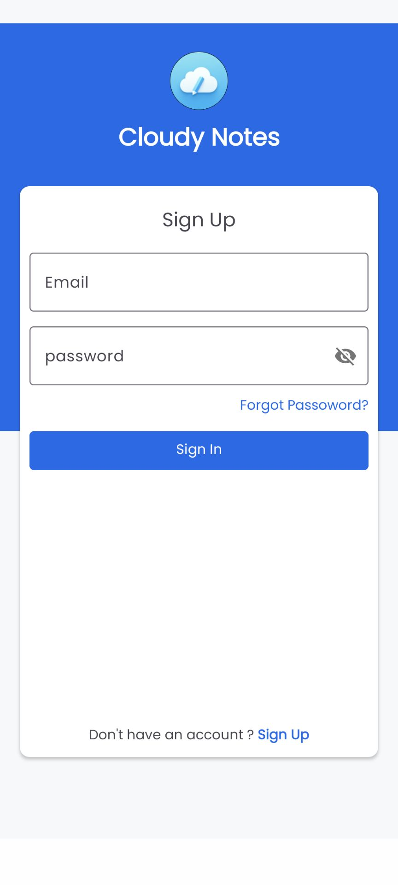
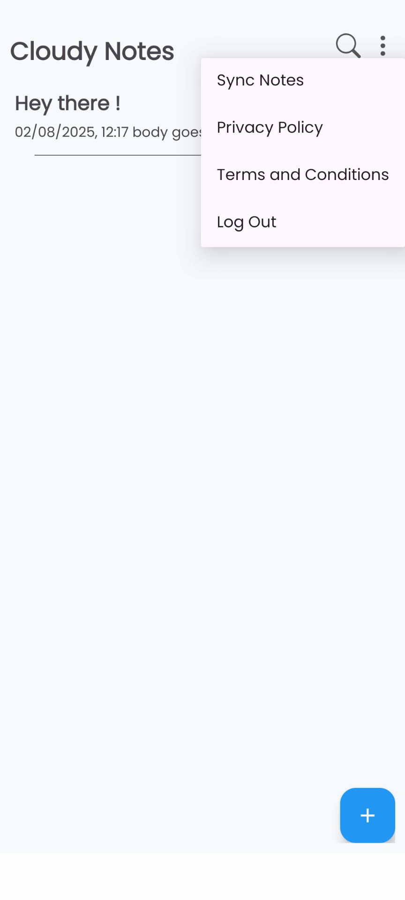
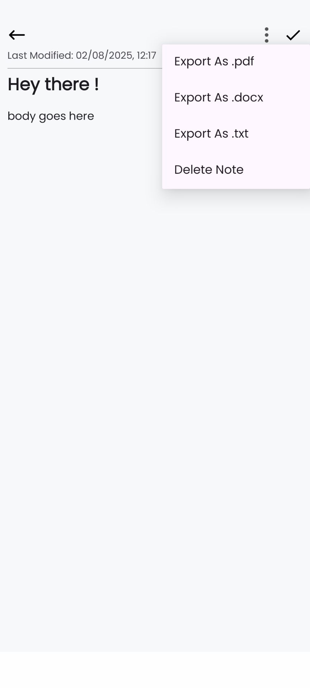

# ☁️ Cloudy Notes

**Cloudy Notes** is a modern Android note-taking app designed to keep your thoughts, ideas, and to-dos organized. It comes with cloud backup, real-time syncing, and flexible export options including PDF and DOC formats. Perfect for students, professionals, or anyone who loves keeping their notes safe and accessible across devices.

---

## 📱 Features

* **Create, Edit, and Delete Notes:** Quickly jot down ideas or important tasks.
* **Cloud Backup & Sync:** Your notes are automatically backed up and synced across devices.
* **Export Notes:** Export individual or multiple notes as PDF, DOC, or TXT.
* **Search & Organize:** Easily search notes and categorize them using tags or folders.
* **Offline Access:** Access your notes even without an internet connection.
* **Simple and Intuitive UI:** Minimalist design with easy navigation.
* **Collaborative note editing

---

## ⚙️ Technologies Used

* **Android Studio** (Java)
* **SQLite** for local storage
* **PDF & DOC Export Libraries** (e.g., iText, Apache POI)
* **Material Design 3** for UI

---

## 🚀 Installation

1. Clone the repository:

   ```bash
   git clone https://github.com/tajimz/cloudy-notes.git
   ```
2. Open the project in **Android Studio**.
3. Sync Gradle and build the project.
4. Run on an Android device or emulator (API level 21+ recommended).

---

## 📝 Usage

* Open the app and sign in with your Google account (if cloud sync is enabled).
* Tap **+** to create a new note.
* Use the **Export** button to save notes as PDF or DOC.
* Access your notes anytime; changes are synced across your devices automatically.

---

## 📸 Screenshots

<p float="left">
  
  
  
  
</p>
---

## 💡 Future Enhancements

* Dark mode / theme customization
* Reminder & notifications for notes
* Handwriting support

---

## 📄 License

This project is licensed under the **MIT License** – see the [LICENSE](LICENSE) file for details.

